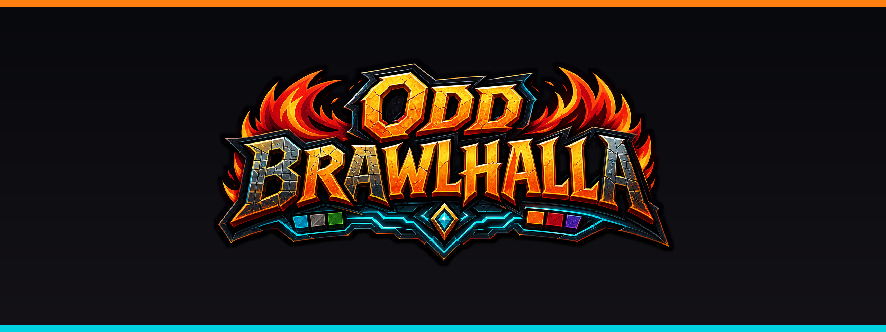
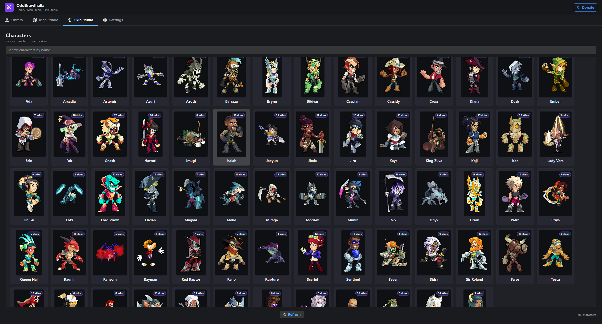
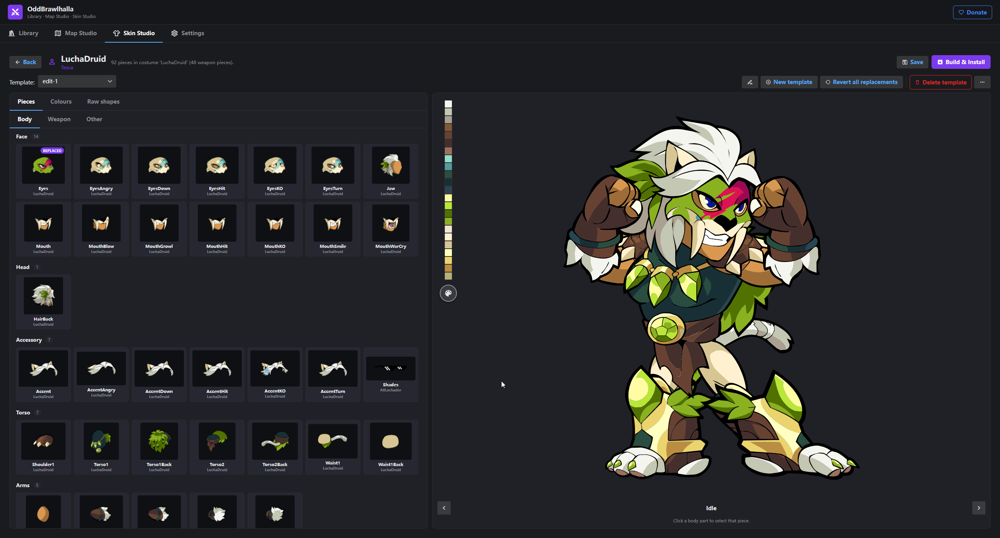
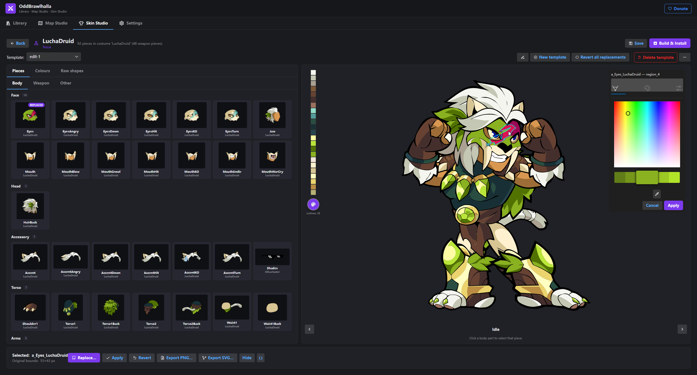
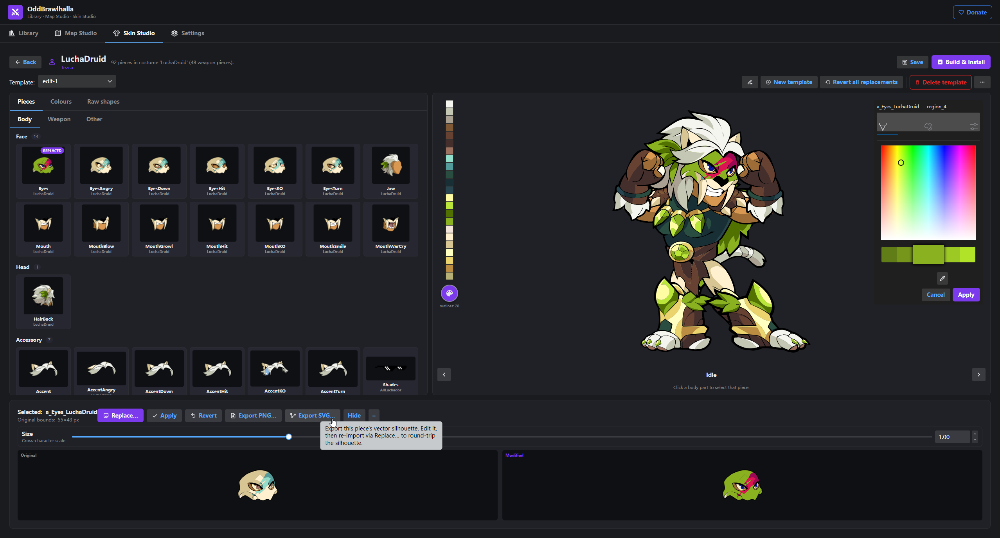

<div align="center">



<h1>Odd Brawlhalla</h1>

<p><strong>Browse, recolor, and remix every Brawlhalla legend's skin art — right on your desktop.</strong></p>

<p>
  <a href="https://github.com/odd999/Odd-Brawlhalla/releases/latest">
    
  </a>
  <a href="https://github.com/odd999/Odd-Brawlhalla/releases">
    
  </a>
  
  
</p>

<p>
  <a href="https://github.com/odd999/Odd-Brawlhalla/releases/latest"><b>⬇ Download Setup.exe</b></a>
  &nbsp;·&nbsp;
  <a href="#-features"><b>Features</b></a>
  &nbsp;·&nbsp;
  <a href="#-how-it-works"><b>How it works</b></a>
  &nbsp;·&nbsp;
  <a href="#-eac-safety"><b>EAC safety</b></a>
  &nbsp;·&nbsp;
  <a href="#-donate"><b>Donate</b></a>
</p>

</div>

---

## What is Odd Brawlhalla?

**Odd Brawlhalla** is a free Windows app that lets you explore the art behind every playable Brawlhalla legend, recolor any costume, swap individual shapes, and export the result as a modded `.swf` you can load into the game.

It reads your installed game directly — no separate dumps, no command-line tinkering — and gives you a clean, two-tier browser to dive from a legend straight into the editor.

> Built by a fan, for fans. Not affiliated with Blue Mammoth Games or Ubisoft.

---

## 📸 Screenshots

<!--
Tip: drag-and-drop your screenshots into a comment box in any GitHub issue,
copy the rendered link, and paste it here. Replace these placeholders.
Recommended captures:
  1. Two-tier browser — legends grid → costumes grid
  2. The editor: SVG preview + color scheme picker
  3. A before/after recolor (split view or two side-by-side shots)
-->

<table>
  <tr>
    <td align="center" width="50%">
      <br/>
      <sub><b>Two-tier browser</b> — pick a legend, see every costume.</sub>
    </td>
    <td align="center" width="50%">
      <br/>
      <sub><b>Editor</b> — live SVG preview, color schemes, shape replace.</sub>
    </td>
  </tr>
  <tr>
    <td align="center" width="50%">
      <br/>
      <sub><b>Recolor</b> — apply any of the 75 in-game color schemes.</sub>
    </td>
    <td align="center" width="50%">
      <br/>
      <sub><b>Export</b> — write a clean modded SWF, PNG, or SVG.</sub>
    </td>
  </tr>
</table>

---

## ✨ Features

- **🗂 Every legend, every costume** — a curated catalog of **all 68 playable legends and 764 costumes**, including crossovers (Lara Croft, Master Chief, Rayman, Shovel Knight, Po, Hellboy, Finn & Jake, and more).
- **🎨 Native SVG preview** — costumes render as crisp vector art that scales to any zoom level. No blurry pixel previews.
- **🖌 Live recoloring** — flip between any of the 75 official color schemes, or build a custom palette and see it on the legend instantly.
- **🧩 Shape replace** — swap individual SWF shapes with your own PNG or SVG artwork, with full round-trip support via the bundled JPEXS workflow.
- **🦴 Pose-aware compositing** — silhouette hit-testing lets you click directly on a body part to select the underlying bone and slot.
- **♻ Default-skin-first ordering** — every legend's grid leads with the canonical costume, so you always know what "stock" looks like.
- **🚀 One-click updates** — the app self-updates via [Velopack](https://github.com/velopack/velopack); just hit "Check for updates" or wait for the next launch.
- **📦 Clean Windows installer** — a single `Setup.exe`, no admin rights required, installs to your local profile.

---

## ⬇ Download &amp; Install

1. **Grab the latest release →** [**Download Setup.exe**](https://github.com/odd999/Odd-Brawlhalla/releases/latest)
2. Run the installer (Windows 10 / 11).
3. On first launch, point it at your **Brawlhalla install folder** (e.g. `C:\Program Files (x86)\Steam\steamapps\common\Brawlhalla`).
4. Browse, recolor, export. That's it.

> **Heads-up on SmartScreen.** The v1 builds are unsigned — Windows may show a *"Windows protected your PC"* dialog the first time you run `Setup.exe`. Click **More info → Run anyway**. Code-signing is on the roadmap.

---

## 🧭 How it works

```
┌──────────────────────┐     ┌─────────────────────┐     ┌──────────────────────┐
│  Legends grid        │ ──▶ │  Costumes grid      │ ──▶ │  Editor              │
│  (68 legends)        │     │  (default first)    │     │  · SVG preview       │
└──────────────────────┘     └─────────────────────┘     │  · Color schemes     │
                                                         │  · Shape replace     │
                                                         │  · Export SWF/PNG/SVG│
                                                         └──────────────────────┘
```

Under the hood, Odd Brawlhalla reads your `Game.swz` / `Init.swz` archives in-place (read-only) to discover characters, costumes, bones, and color schemes — then composes a live SVG preview from the game's own vector art. When you export, it writes a fresh `.swf` you can drop next to the original.

The app **never modifies `Game.swz` or `Gfx_Hands.swf`** — those are off-limits to protect your EAC integrity and avoid cross-legend palette pollution.

---

## ⚠ EAC safety

> **Do not play ranked or online tournaments while you have modded SWFs loaded into Brawlhalla.**

Brawlhalla uses Easy Anti-Cheat. EAC will flag modified game files and **can suspend your account**. Odd Brawlhalla itself is safe to run — it only *reads* the game — but the modded `.swf` files it produces are for **offline / custom-game / casual** use only.

Rule of thumb: **uninstall your mods before going online.**

---

## 🛠 Tech &amp; stack

- **.NET 8** · **Avalonia UI** (cross-platform XAML UI toolkit)
- **Velopack** for installer + auto-update
- **JPEXS-derived SWF tooling** for shape round-trips
- **MIT licensed** — bundled OSS is all MIT-compatible

---

## 🗺 Roadmap

- [ ] Authenticode code-signing (kill the SmartScreen warning)
- [ ] Per-costume favorites + tagging
- [ ] One-click "install to game" + restore-vanilla
- [ ] Multi-shape weapon recolor presets
- [ ] Community palette sharing

Got an idea? **[Open an issue](https://github.com/odd999/Odd-Brawlhalla/issues/new)** — feedback shapes what ships next.

---

## 🙏 Credits

Odd Brawlhalla stands on the shoulders of the Brawlhalla modding community. Huge thanks to:

- The **[JPEXS Free Flash Decompiler](https://github.com/jindrapetrik/jpexs-decompiler)** team — the SWF round-trip would be impossible without it.
- **moffel** and the **WallyMapEditor / WallyAnmSpinzor / BrawlhallaSwz** authors — for reverse-engineering the SWZ container and animation format.
- Everyone on **GameBanana** who documented the manual workflow before tools like this existed.

Brawlhalla © Blue Mammoth Games / Ubisoft. This project is fan-made and unaffiliated.

---

## 💛 Donate

If Odd Brawlhalla saved you hours of JPEXS clicking, a coffee goes a long way:

<p>
  <a href="https://www.paypal.com/donate/?business=moalketbi9@gmail.com">
    
  </a>
</p>

---

## 📄 License

[MIT](LICENSE) — do whatever you want, just don't blame me if something breaks.

<div align="center">
  <sub>Made with 🔥 by <a href="https://github.com/odd999">Odd</a>.</sub>
</div>
